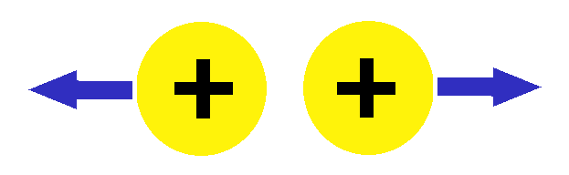

<youtube-video videoId="QrwUYbVkfkQ"></youtube-video>

What is electricity?  You already know that electricity is the 
thing we use to power everything from the lights in our house to 
the cellphones in our hands.  The discovery of electricity 
revolutionized the world; it is the seed from which nearly 
everything in modern society is built.  But what IS it?  Well, 
we can think of electricity as a form of energy that uses 
charges to generate power.  

Charge is a physical property of 
matter and the fundamental unit of electricity.  Charge can be 
positive or negative; a lack of charge is defined as neutral.

Charges interact with each other through the 
*electromagnetic force*.  They experience a pushing or pulling force 
depending on the kind of charge they are interacting with.  When 
we have two charges of the same type, they interact by pushing 
themselves away from one another.  This goes to say that 
positive-positive charges and negative-negative charges repel 
each other.  

What do you think happens when the charges are 
different types?

As you may have guessed, they are attracted to each other! 

Static electricity is when one type of charge builds up in an 
object, leading to an imbalance in the total charge.  If we have 
many more negative charges than positive charges, the negative 
charges start to push on each other harder and harder.  This force 
puts pressure on the extra negative charge, making it want 
to escape.  But it is has nowhere to go.  This scenario has 
surely happened to you before.  Have you ever poked your 
friend in the face (assuming it’s normal behavior to poke a 
friend’s face) and gotten shocked?  When you come into contact 
with your friend, you provide the extra charge a way to 
escape – it doesn’t hasten!  The charge jumps across your 
finger onto your friend as it desperately tries to get as 
far away as possible.  We feel this jump as a shock.

The extra charge was transferred from your body to your 
friend’s body.  This movement of charge is precisely what we 
call a current.  We have now arrived at a very important 
concept in electricity: current.  Current is simply defined 
as the motion of electric charge -  it is a flow of energy 
that is used in nearly every kind of electrical application.

