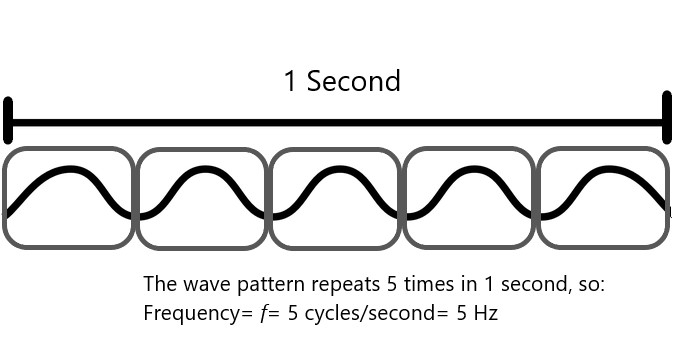
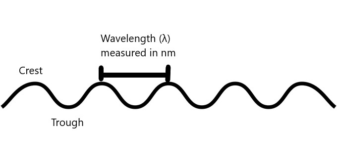
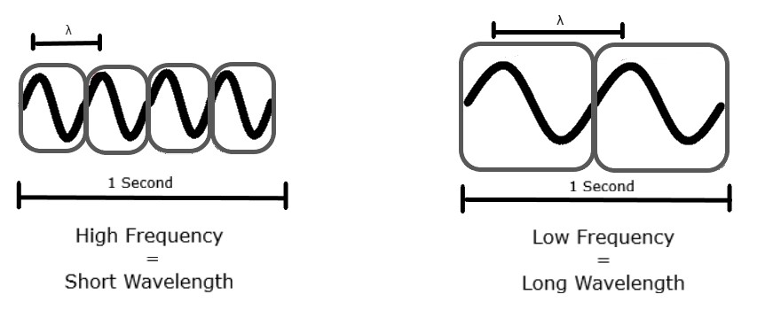
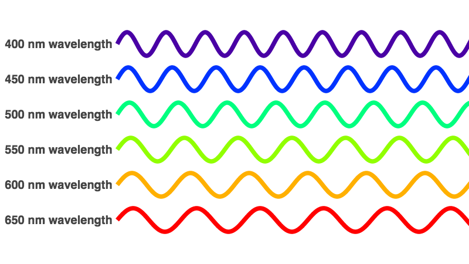

Have you ever wondered what light is made of? This is actually
quite a complicated question, so for now we will describe light as
a type of energy that moves like a wave.

## Light as a Wave

In physics, a wave refers to a disturbance that transfers energy
between different locations. Light falls under the category of
_electromagnetic_ waves, which don’t require a medium or matter to
transfer their energy.

One important property of waves that relates to light is
frequency. Frequency is the number of times per second that
the wave cycles. You can think of this as the number of times
that the wave pattern repeats, or how fast the wave goes up
and down. The frequency is measured in cycles per second or
_Hertz (Hz)_, and has the symbol lowercase _f_.

Another important property of waves is the period. This is the distance
between two peaks or crests. When talking about light, the period is called
the wavelength and is measured in nanometres (_nm_), with the symbol lambda (_λ_).

Frequency and wavelength are inversely related. So, a low frequency has a
long wavelength, and a high frequency has a short wavelength.

There are many different types of light waves, including Ultraviolet light,
Infrared light, Microwaves and X-rays. Together all these types of light are
called the electromagnetic spectrum. The range of the electromagnetic spectrum
that we can see is called visible light.

The colour of visible light depends on the frequency and wavelength.
Red light has the longest wavelength at 700nm. As the wavelength shrinks the
colours change to orange, then yellow, green blue, indigo, and finally violet
with the smallest visible wavelength of about 400nm.

Now that you understand how light acts as a wave, check out the videos below to
see how this light interacts with the things around us.

## Reflection

<youtube-video videoId="qTD-SPze8UE"></youtube-video>

## Refraction

<youtube-video videoId="oXPOzZUjGRw"></youtube-video>

## Activity

<optics-maze></optics-maze>
